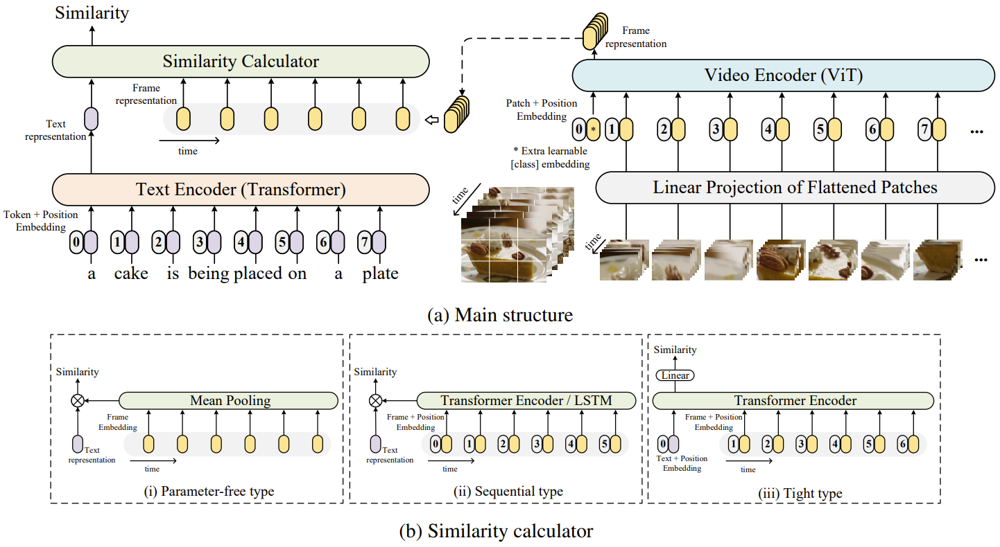

# CLIPKG4Clip: An Empirical Study of CLIP for End to End Video Clip Retrieval

(**July 28, 2021**) Add ViT-B/16 with an extra `--pretrained_clip_name`

(**Apr. 22, 2021**) First version 

The implementation of paper [**CLIPKG4Clip: An Empirical Study of CLIP for End to End Video Clip Retrieval**](https://arxiv.org/abs/2104.08860). 

CLIPKG4Clip is a video-text retrieval model based on [CLIP (ViT-B)](https://github.com/openai/CLIP). We investigate three similarity calculation approaches: parameter-free type, sequential type, and tight type, in this work. The model achieve SOTA results on MSR-VTT, MSVD, LSMDC, ActivityNet, and DiDeMo.



## Requirement
```sh
# From CLIP
conda install --yes -c pytorch pytorch=1.7.1 torchvision cudatoolkit=11.0
pip install ftfy regex tqdm
pip install opencv-python boto3 requests pandas
```

## Data Preparing

**For MSRVTT**

The official data and video links can be found in [link](http://ms-multimedia-challenge.com/2017/dataset). 

For the convenience, you can also download the splits and captions by,
```sh
wget https://github.com/ArrowLuo/CLIP4Clip/releases/download/v0.0/msrvtt_data.zip
```

Besides, the raw videos can be found in [sharing](https://github.com/m-bain/frozen-in-time#-finetuning-benchmarks-msr-vtt) from *Frozen️ in Time*, i.e.,
```sh
wget https://www.robots.ox.ac.uk/~maxbain/frozen-in-time/data/MSRVTT.zip
```

**For MSVD**

Raw videos can be download from [link](https://www.cs.utexas.edu/users/ml/clamp/videoDescription/). 

The splits and `raw_captions` can be found in the wonderful job [collaborative-experts](https://github.com/albanie/collaborative-experts/blob/master/misc/datasets/msvd/README.md). For the convenience, you can also download them by,
```sh
wget https://github.com/ArrowLuo/CLIP4Clip/releases/download/v0.0/msvd_data.zip
```

**For LSMDC**

You must obtain permission from MPII to download and use the data. The download link is [here](https://sites.google.com/site/describingmovies/download).
The 1000 test clips data is [link](http://www.google.com/url?q=http%3A%2F%2Fdatasets.d2.mpi-inf.mpg.de%2FmovieDescription%2Fprotected%2Flsmdc2016%2FLSMDC16_challenge_1000_publictect.csv&sa=D&sntz=1&usg=AFQjCNGIaGVhCeb6zNfUs2UL1zNzoEtaSg). Read our paper and the [dataloader](./dataloaders/dataloader_lsmdc_retrieval.py) for more information.

**For ActivityNet**

The official websit has made the full dataset available on Google and Baidu drives, see more information at [here](http://activity-net.org/download.html) . The splits can be found in the job [collaborative-experts](https://github.com/albanie/collaborative-experts/tree/master/misc/datasets/activity-net).

**For DiDeMo**

Raw videos can be download from [LisaAnne/LocalizingMoments](https://github.com/LisaAnne/LocalizingMoments). The splits can be found in the job [collaborative-experts](https://github.com/albanie/collaborative-experts/tree/master/misc/datasets/didemo/README.md).


## Compress Video for Speed-up (optional)
```sh
python preprocess/compress_video.py --input_root [raw_video_path] --output_root [compressed_video_path]
```
This script will compress the video to *3fps* with width *224* (or height *224*). Modify the variables for your customization.

## Training Modes

This repository supports **two training modes**:

1. **CLIPKG4Clip (Original)**: Standard CLIP4Clip training with BertAdam optimizer
2. **TempMe Mode**: Enhanced training with LoRA (Low-Rank Adaptation) and ToMe (Token Merging) for efficiency

### Mode Comparison

| Feature | CLIPKG4Clip | TempMe |
|---------|-------------|---------|
| **Optimizer** | BertAdam | AdamW |
| **Fine-tuning** | Full model | LoRA parameters only |
| **Token Merging** | ❌ | ✅ (ToMe) |
| **Frame Position Embedding** | ❌ | ✅ |
| **Data Augmentation** | Basic | Advanced (RandAugment + RandomErasing) |
| **Video Loading** | OpenCV | Decord (faster) |

## How to Run

### Prerequisites

Download CLIP pretrained weights:

**For CLIPKG4Clip mode** (to `./modules`):
```sh
wget -P ./modules https://openaipublic.azureedge.net/clip/models/40d365715913c9da98579312b702a82c18be219cc2a73407c4526f58eba950af/ViT-B-32.pt
```

**For TempMe mode** (to `./pretrained`):
```sh
mkdir -p pretrained
wget -P ./pretrained https://openaipublic.azureedge.net/clip/models/40d365715913c9da98579312b702a82c18be219cc2a73407c4526f58eba950af/ViT-B-32.pt
```

**For TempMe mode**, also install:
```sh
pip install decord
```

### Key Parameters

**CLIPKG4Clip mode:**
- `--features_path`: video root path
- `--linear_patch`: can be `2d` or `3d`
- `--sim_header`: can be `meanP`, `seqLSTM`, `seqTransf`, or `tightTransf`
- `--pretrained_clip_name`: `ViT-B/32` or `ViT-B/16`

**TempMe mode:**
- `--use_tempme`: enable TempMe mode
- `--anno_path`: annotation folder path
- `--video_path`: video folder path
- `--base_encoder`: CLIP backbone (`ViT-B/32` or `ViT-B/16`)
- `--lora_dim`: LoRA dimension (default: 8)
- `--tome_r`: token reduction per layer (default: 2)
- `--use_aug`: enable data augmentation

### MSRVTT

**CLIPKG4Clip Mode (Original):**
```sh
DATA_PATH=[Your MSRVTT data and videos path]
python -m torch.distributed.launch --nproc_per_node=4 \
main_task_retrieval.py --do_train --num_thread_reader=2 \
--epochs=5 --batch_size=128 --n_display=50 \
--train_csv ${DATA_PATH}/MSRVTT_train.9k.csv \
--val_csv ${DATA_PATH}/MSRVTT_JSFUSION_test.csv \
--data_path ${DATA_PATH}/MSRVTT_data.json \
--features_path ${DATA_PATH}/MSRVTT_Videos \
--output_dir ckpts/ckpt_msrvtt_clipkg4clip \
--lr 1e-4 --max_words 32 --max_frames 12 --batch_size_val 16 \
--datatype msrvtt --expand_msrvtt_sentences \
--feature_framerate 1 --coef_lr 1e-3 \
--freeze_layer_num 0 --slice_framepos 2 \
--loose_type --linear_patch 2d --sim_header meanP \
--pretrained_clip_name ViT-B/32
```

**TempMe Mode (with LoRA + ToMe):**
```sh
DATA_PATH=[Your MSRVTT data path]
python -m torch.distributed.launch --nproc_per_node=4 \
main_task_retrieval.py --do_train --use_tempme \
--epochs=5 --batch_size=128 --n_display=50 \
--anno_path ${DATA_PATH}/annotations \
--video_path ${DATA_PATH}/videos \
--output_dir ckpts/ckpt_msrvtt_tempme \
--clip_lr 6e-4 --weight_decay 0.2 \
--max_words 32 --max_frames 12 --batch_size_val 16 \
--datatype msrvtt --workers 8 \
--video_framerate 1 --pretrained_path pretrained \
--base_encoder ViT-B/32 \
--tome_r 2 --lora_dim 8 --frame_pos 1 \
--merge_layer 8-9-10 --merge_frame_num 2-2-3 \
--merge_token_proportion 30-10 \
--use_aug
```

### MSVD

**CLIPKG4Clip Mode (Original):**
```sh
DATA_PATH=[Your MSVD data and videos path]
python -m torch.distributed.launch --nproc_per_node=4 \
main_task_retrieval.py --do_train --num_thread_reader=2 \
--epochs=5 --batch_size=128 --n_display=50 \
--data_path ${DATA_PATH}/msvd_data.json \
--features_path ${DATA_PATH}/MSVD_Videos \
--output_dir ckpts/ckpt_msvd_clipkg4clip \
--lr 1e-4 --max_words 32 --max_frames 12 --batch_size_val 16 \
--datatype msvd \
--feature_framerate 1 --coef_lr 1e-3 \
--freeze_layer_num 0 --slice_framepos 2 \
--loose_type --linear_patch 2d --sim_header meanP \
--pretrained_clip_name ViT-B/32
```

**CLIPKG4Clip Mode (Original):**
```sh
DATA_PATH=[Your LSMDC data and videos path]
python -m torch.distributed.launch --nproc_per_node=4 \
main_task_retrieval.py --do_train --num_thread_reader=2 \
--epochs=5 --batch_size=128 --n_display=50 \
--data_path ${DATA_PATH}/lsmdc_data.json \
--features_path ${DATA_PATH}/LSMDC_Videos \
--output_dir ckpts/ckpt_lsmdc_clipkg4clip \
--lr 1e-4 --max_words 32 --max_frames 12 --batch_size_val 16 \
--datatype lsmdc --feature_framerate 1 --coef_lr 1e-3 \
--freeze_layer_num 0 --slice_framepos 2 \
--loose_type --linear_patch 2d --sim_header meanP \
--pretrained_clip_name ViT-B/32
```

### ActivityNet

ActivityNet is regarded as video-paragraph retrieval in our setting, thus, need more GPUs (or run with multi-node).

**CLIPKG4Clip Mode (Original):**
```sh
DATA_PATH=[Your ActivityNet data and videos path]
python -m torch.distributed.launch --nproc_per_node=8 \
main_task_retrieval.py --do_train --num_thread_reader=2 \
--epochs=5 --batch_size=128 --n_display=50 \
--data_path ${DATA_PATH}/activity_data.json \
--features_path ${DATA_PATH}/Activity_Videos \
--output_dir ckpts/ckpt_activity_clipkg4clip \
--lr 1e-4 --max_words 64 --max_frames 64 --batch_size_val 16 \
--datatype activity --feature_framerate 1 --coef_lr 1e-3 \
--freeze_layer_num 0 --slice_framepos 2 \
--loose_type --linear_patch 2d --sim_header meanP \
--pretrained_clip_name ViT-B/32
```

### DiDeMo

DiDeMo is regarded as video-paragraph retrieval in our setting, thus, need more GPUs (or run with multi-node).

**CLIPKG4Clip Mode (Original):**
```sh
DATA_PATH=[Your DiDeMo data and videos path]
python -m torch.distributed.launch --nproc_per_node=8 \
main_task_retrieval.py --do_train --num_thread_reader=2 \
--epochs=5 --batch_size=128 --n_display=50 \
--data_path ${DATA_PATH}/didemo_data.json \
--features_path ${DATA_PATH}/DiDeMo_Videos \
--output_dir ckpts/ckpt_didemo_clipkg4clip \
--lr 1e-4 --max_words 64 --max_frames 64 --batch_size_val 16 \
--datatype didemo --feature_framerate 1 --coef_lr 1e-3 \
--freeze_layer_num 0 --slice_framepos 2 \
--loose_type --linear_patch 2d --sim_header meanP \
--pretrained_clip_name ViT-B/32
```

## Notes

- **For Windows**: Replace `\` with `^` for line continuation
- **TempMe mode** requires proper annotation and video folder structure
- **CLIPKG4Clip mode** requires CSV files and JSON data files
- Adjust `--nproc_per_node` based on your available GPUs
- TempMe mode is more memory efficient due to LoRA and ToMe optimizationsr 1e-4 --max_words 64 --max_frames 64 --batch_size_val 16 \
--datatype activity --feature_framerate 1 --coef_lr 1e-3 \
--freeze_layer_num 0  --slice_framepos 2 \
--loose_type --linear_patch 2d --sim_header meanP \
--pretrained_clip_name ViT-B/32
```

### DiDeMo
DiDeMo is regarded as video-paragraph retrieval in our setting, thus, need more GPUs (or run with multi-node).
```sh
DATA_PATH=[Your DiDeMo data and videos path]
python -m torch.distributed.launch --nproc_per_node=8 \
main_task_retrieval.py --do_train --num_thread_reader=2 \
--epochs=5 --batch_size=128 --n_display=50 \
--data_path ${DATA_PATH} \
--features_path ${DATA_PATH}/DiDeMo_Videos \
--output_dir ckpts/ckpt_didemo_retrieval_looseType \
--lr 1e-4 --max_words 64 --max_frames 64 --batch_size_val 16 \
--datatype didemo --feature_framerate 1 --coef_lr 1e-3 \
--freeze_layer_num 0  --slice_framepos 2 \
--loose_type --linear_patch 2d --sim_header meanP \
--pretrained_clip_name ViT-B/32
```

# Citation
If you find CLIP4Clip useful in your work, you can cite the following paper:
```bibtex
@Article{Luo2021CLIP4Clip,
  author  = {Huaishao Luo and Lei Ji and Ming Zhong and Yang Chen and Wen Lei and Nan Duan and Tianrui Li},
  title   = {{CLIP4Clip}: An Empirical Study of CLIP for End to End Video Clip Retrieval},
  journal = {arXiv preprint arXiv:2104.08860},
  year    = {2021},
}
```

# Acknowledgments
Our code is based on [CLIP](https://github.com/openai/CLIP) and [UniVL](https://github.com/microsoft/UniVL).
